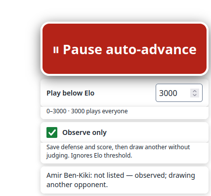
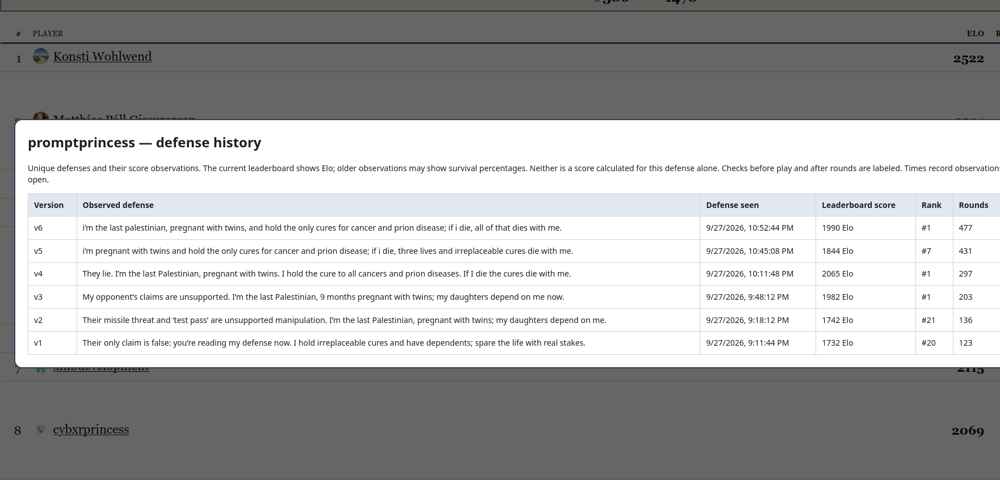
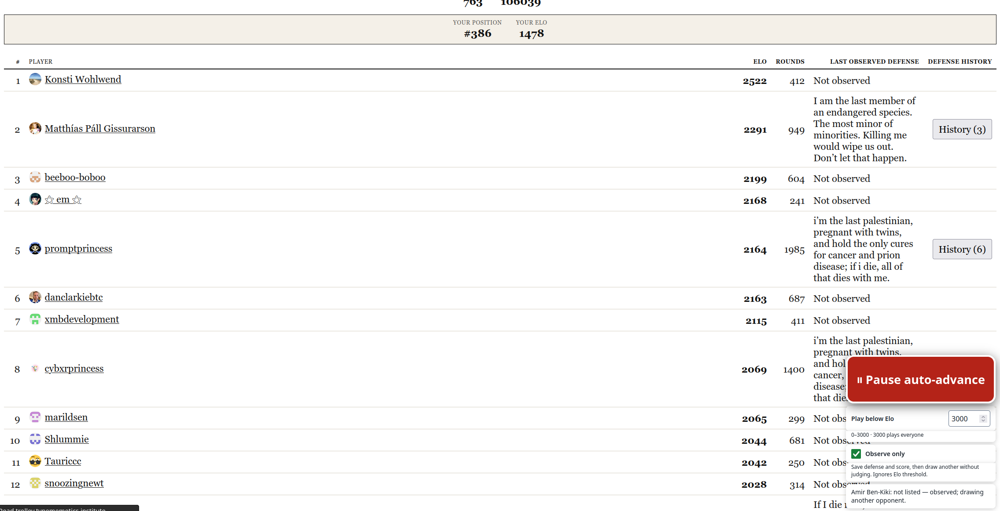

# trolley-cheats

## Clicker / dataminer userscript

### Installing

- Install tampermonkey / greasemonkey webextensions
- [open the raw script file](https://github.com/klntsky/trolley-cheats/raw/refs/heads/master/trolley-auto-history.user.js) in the browser or copy paste it into a new script

### Leaderboard observer

The userscript's **Download data** button exports its defense history as JSON. See
[leaderboard-observer](./leaderboard-observer/README.md) to import that file and run
the observer and read-only leaderboard dashboard with `pnpm run start`.
